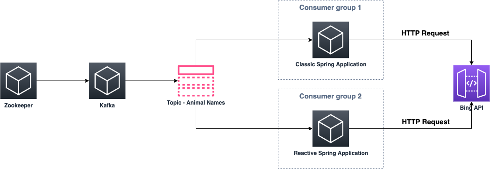

# Consumer Kafka Reativo

## Sumário
1. [Objetivo](##Objetivo)
2. [Resultados](##Resultados)

## Objetivo

O objetivo desse exemplo é comparar um <i>consumer</i> Kafka construído na linguagem Java e [<i>Spring for Apache Kafka</i>](https://spring.io/projects/spring-kafka) com um outro <i>consumer</i> Kafka contruído na linguagem Java com [<i>Spring Webflux</i>](https://docs.spring.io/spring-framework/docs/current/reference/html/web-reactive.html#webflux) e [<i>reactor-kafka</i>](https://projectreactor.io/docs/kafka/release/reference/).

Para realizarmos a comparação, foi criada uma [lista de nomes de animais](Examples/Consumer%20Kafka%20Reativo/kafka-producer/src/main/resources/animals.txt). O projeto do [kafka-producer](Examples/Consumer%20Kafka%20Reativo/kafka-producer) lê essa lista e insere os nomes dentro da plataforma Kafka. Uma vez inseridos, os nomes podem ser consumidos de maneira concorrente pelo [spring-kafka-consumer](Examples/Consumer%20Kafka%20Reativo/spring-kafka-consumer) e [spring-reactive-kafka-consumer](Examples/Consumer%20Kafka%20Reativo/spring-reactive-kafka-consumer). Os <i>consumers</i> por sua vez iniciam uma requisição HTTP com a [<i>API do Bing</i>](https://azure.microsoft.com/pt-br/pricing/details/cognitive-services/search-api/) para cada nome recebido.

## Resultados

Através de um [<i>Notebook</i>](Examples/Consumer Kafka Reativo/spring-kafka-analyzer.ipynb) [<i>Jupyter</i>](https://jupyter.org/), analisei os logs de ambas as aplicações para entender se houve um ganho na utilização do modelo não bloqueante em conjunto com a programação reativa. Enquanto o  <i>consumer</i> Kafka não reativo levou certa de 723,596 segundos para consumir e requisitar todos os nomes na <i>API do Bing</i>, o <i>consumer</i> Kafka reativo levou cerca de 24,688 segundos, representando uma <b>melhoria de 96,5881513994% no tempo de processamento final</b>.

### Por que isso acontece?

Quando analisamos os dados dos logs percebemos que o número de <i>threads</i> utilizadas na aplicação reativa é 5 vezes maior que o número de <i>threads</i> utilizada na versão não reativa. Essa diferença se deve a natureza do <i>reactor-kafka</i> que não bloqueia a <i>thread</i> principal, o componente [<i>WebClient</i>](https://docs.spring.io/spring-framework/docs/current/reference/html/web-reactive.html#webflux-client) utilizado nas requisições para a <i>API do Bing</i> também é não bloqueante e mantém por padrão um <i>pool</i> contendo 3 NIO <i>threads</i>. Portanto nossa aplicação reativa é mais eficiente na tarefa de consumir do Kafka e requisitar para a <i>API do Bing</i>.

A consulta na <i>API do Bing</i> foi escolhida justamente por permitir que nossa aplicação reativa escalasse o número de consultas paralelas ao máximo possível. <b>Entretanto, muitas vezes é importante entender quantas requisições simultâneas podemos fazer para cada serviço que consumimos</b>.

### Posso replicar os testes?

Os projetos do kafka-producer, spring-kafka-consumer e spring-reactive-kafka-consumer estão disponíveis no respositório, entretanto, para realizar consultas na <i>API do Bing</i> é necessário ter uma chave de API que possui um custo. O [<i>Notebook Jupyter</i>](https://jupyter.org/) utilizado para análise dos logs das aplicações também foi disponibilizado.