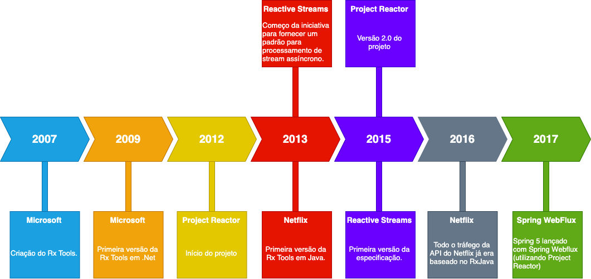
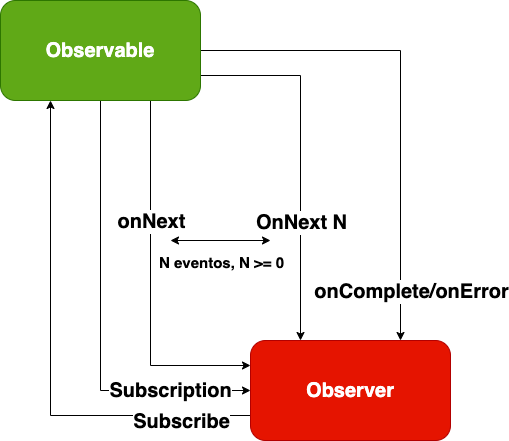
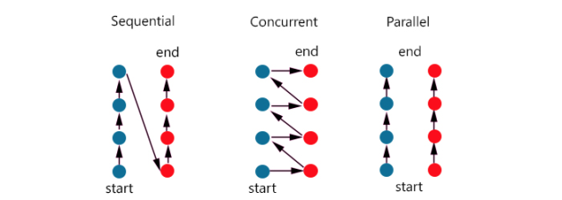
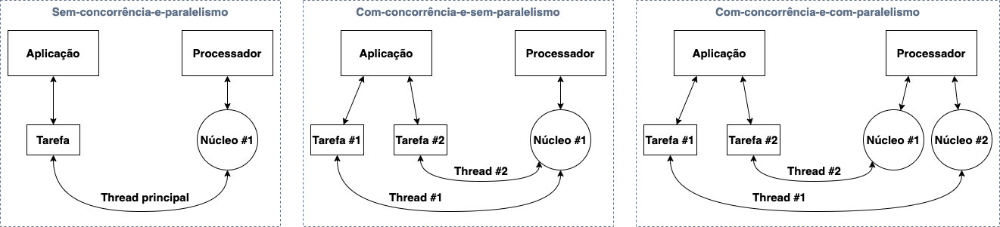
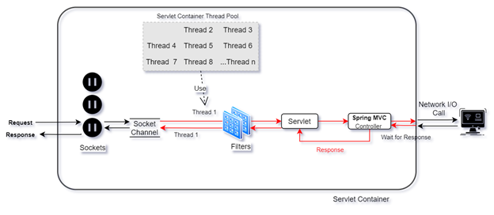
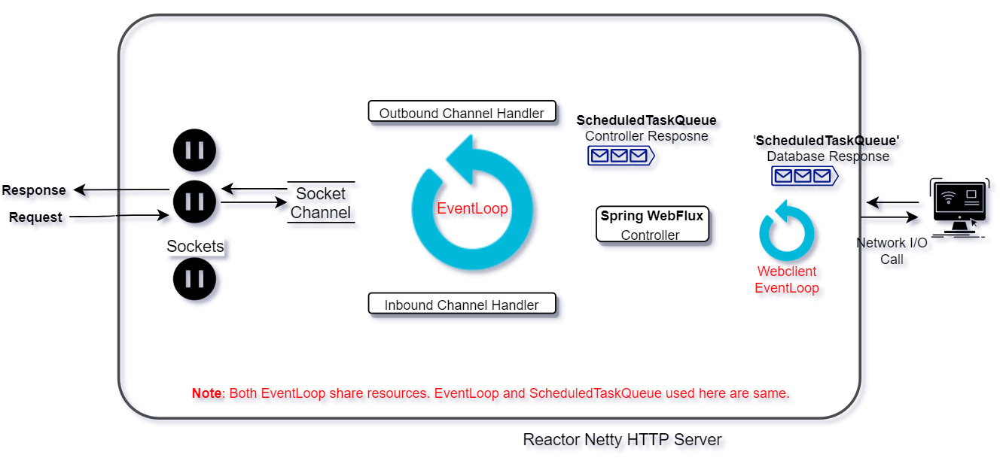

# Programação reativa com Spring WebFlux

## Sumário
1. [O que é programação reativa?](##-O-que-é-programação-reativa?)
2. [Spring-Webflux]()
3. [Exemplos do repositório]()
4. [Referências]()

## O que é programação reativa?

Programação reativa é um paradigma de programação assíncrona para construção de aplicações não-bloqueantes. Para isso o paradigma utiliza o conceito de <i>data streams</i> e propagação de mudanças.

Em meados de 2007 a Microsoft criou o [<i>Reactive Extensions</i> (Rx)](https://en.wikipedia.org/wiki/ReactiveX) com o intuito de representar <i>streams</i> contínuas de eventos assíncronos com diversos operadores para transformação (como: map, filter, reduce) e combinacão de diferentes <i>streams</i>. Com o passar dos anos, o projeto Reactive Extensions ganhou versões em diversas linguagens diferentes e uma especificação para bibliotecas reativas surgiu e foi incorporada no Java 9. Em 2017, o [Spring 5](https://spring.io/) foi lançado incluindo a stack reativa denominada [Spring WebFlux](https://docs.spring.io/spring-framework/docs/current/reference/html/web-reactive.html) que utilizava internamente o [Project Reactor](https://projectreactor.io/docs/core/3.4.11/reference/index.html#about-doc).

O paradigma reativo é geralmente apresentado como uma extensão do [<i>design pattern Observer</i>](https://docs.microsoft.com/pt-br/dotnet/standard/events/observer-design-pattern). Também é possível comparar o padrão [<i>reactive streams</i>](https://www.reactive-streams.org/) com o [<i>Iterator pattern</i>](https://en.wikipedia.org/wiki/Iterator_pattern). A grande diferença é que enquanto o <i>reactive streams</i> é baseado em operações <i>push</i>, o <i>Iterator pattern</i> é baseado em operações <i>pull</i>. Essa diferença é um dos pilares que possibilita o paradigma reativo. Além de enviar valores (<i>push</i>), um <i>observable</i> ou <i>publisher</i> pode sinalizar um erro ou a finalização do processo.

## Concorrência e paralelismo

Aplicações modernas possuem um grande número de usuários ativos disputando por recursos. Existem diversos modelos que nos ajudam a escalar uma aplicação para que ela possa continuar responsiva.

Quando quebramos o nosso processo em pequenas tarefas capazes de serem executadas de maneira independente, obtemos o que denominamos concorrência. A concorrência é o primeiro passo em direção ao paralelismo, pois a partir dela, as tarefas podem começar a disputar recursos para execução. Já o paralelismo pode ser adicionado posteiormente para permitir a execução das tarefas independentes de maneira paralela. Veja mais sobre [aqui](https://www.youtube.com/watch?v=oV9rvDllKEg&ab_channel=gnbitcom).

## Modelo de Thread por requisição e Event Loop

Uma vez que conceituamos concorrência e paralelismo, podemos considerar como paralelizar a execução de tarefas concorrentes. Para executar tarefas de maneira concorrente, faremos uso de um recurso do sistema operacional, denominado [<i>thread</i>](https://pt.wikipedia.org/wiki/Thread_(computa%C3%A7%C3%A3o)). Muitas linguagens como Java possuem ferramentas que permitem a criação de <i>threads</i>. Entretanto <i>threads</i> sozinhas não garantem o paralelismo mas na maioria das vezes serão mais efetivas do que executar um processo fora do modelo de concorrência, isso porque o núcleo do processador realizará trocas tão rápidas entre as <i>threads</i> que muitas vezes podemos acreditar as mesmas estão sendo executadas paralelamente. Por fim, quando temos um [processador com múltiplos núcleos](https://pt.wikipedia.org/wiki/Processador_multin%C3%BAcleo) nossas diferentes <i>threads</i> começam a executar de maneira verdadeiramente simultânea e partir de então, alcançamos de fato, o paralelismo.

Existem dois grandes modelos de trabalho utilizando <i>Threads</i>, o primeiro e talvez mais famoso é denominado Thread por requisição ([<i>thread per request</i>](https://www.youtube.com/watch?v=oDw_LHxFTeo&ab_channel=Infybuzz)). Nesse modelo a aplicação mantém um conjunto de <i>Threads</i> (<i>Thread pool</i>) e cada requisição recebida pela aplicação utiliza uma das <i>Threads</i> do conjunto. No mundo moderno, principalmente com o advento de microserviços nossas aplicações estão constatemente se comunicando de maneira síncrona umas com as outras. <b>Portanto, nesse modelo, muitas vezes nossas requisições estão bloqueando <i>Threads</i> do conjunto enquanto aguardam respostas de componentes terceiros</b>.

Já o segundo modelo, denominado [<i>Event Loop</i>](https://dzone.com/articles/spring-webflux-eventloop-vs-thread-per-request-mod), propõe uma única <i>Non-Blocking I/O Thread</i> (NIO) que executa indefinidamente respondendo requisições de um conjunto de [<i>sockets channels</i>](https://www.developer.com/design/understanding-asynchronous-socket-channels-in-java/). É muito importante que a NIO <i>Thread</i> não seja bloqueada em nenhum momento por conta de comunicações síncronas com componentes externos, portanto para esse tipo de trabalho o modelo utiliza um conjunto de <i>Threads</i> separado (esse conjunto também pode ser não bloqueante).

## Spring-WebFlux

## Exemplos do repositório
### Lista de exemplos:
1. [Consumer Kafka Reativo](####-Consumer-Kafka-Reativo)

#### Consumer Kafka Reativo
## Referências