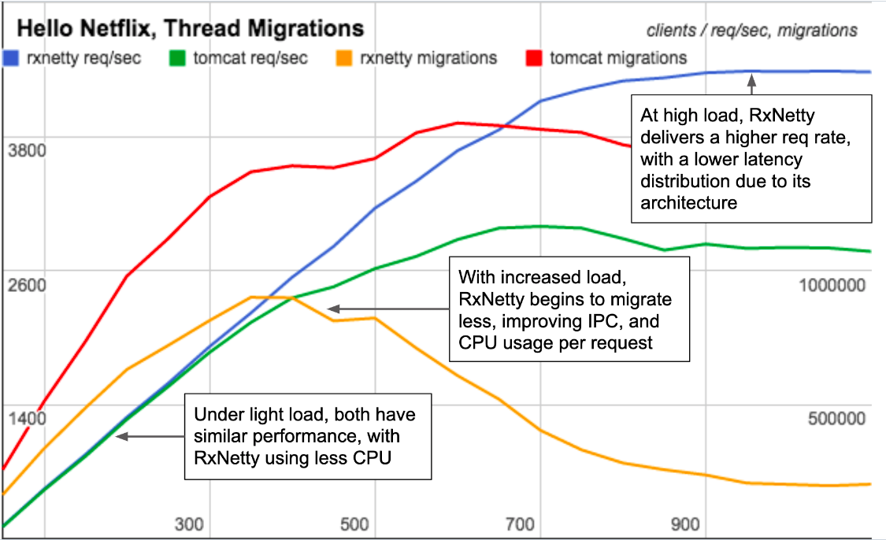
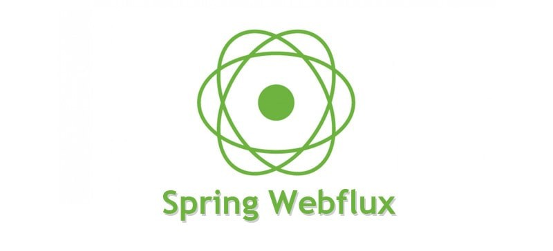
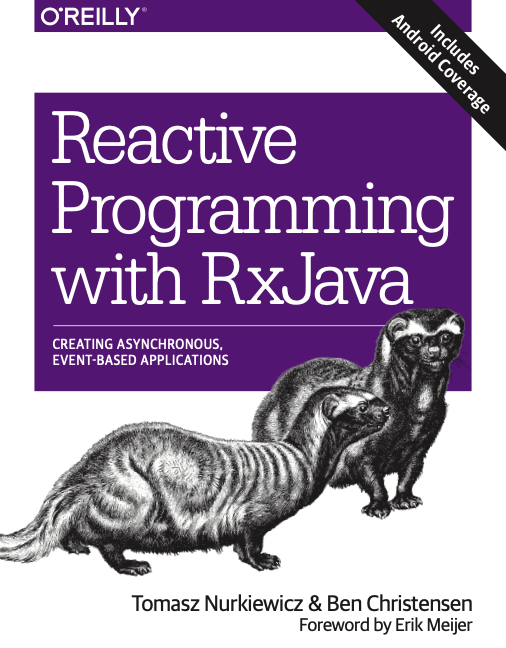
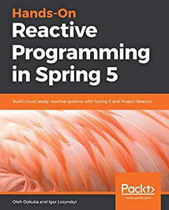

# Programação reativa com <i>Spring WebFlux</i>

## Sumário
1. [O que é programação reativa?](##-O-que-é-programação-reativa?)
2. [Concorrência e paralelismo](##-Concorrência-e-paralelismo)
3. [Modelo de <i>Thread</i> por requisição e <i>Event Loop</i>](##-Modelo-de-Thread-por-requisição-e-Event-Loop)
4. [<i>Spring-Webflux</i>](##-Spring-WebFlux)
5. [<i>Project Reactor</i>](##-Project-Reactor)
6. [Exemplos do repositório](##-Exemplos-do-repositório)
7. [Referências](##-Referências)

## O que é programação reativa?

Programação reativa é um paradigma de programação assíncrona para construção de aplicações não-bloqueantes. Para isso o paradigma utiliza o conceito de <i>data streams</i> e propagação de mudanças.

Em meados de 2007 a Microsoft criou o [<i>Reactive Extensions</i> (Rx)](https://en.wikipedia.org/wiki/ReactiveX) com o intuito de representar <i>streams</i> contínuas de eventos assíncronos com diversos operadores para transformação (como: map, filter, reduce), composição e combinacão de diferentes <i>streams</i>. Com o passar dos anos, o projeto <i>Reactive Extensions</i> ganhou versões em diversas linguagens diferentes e uma especificação para bibliotecas reativas surgiu e foi incorporada no Java 9.

O paradigma reativo é geralmente apresentado como uma extensão do [<i>design pattern Observer</i>](https://docs.microsoft.com/pt-br/dotnet/standard/events/observer-design-pattern). Também é possível comparar o padrão [<i>reactive streams</i>](https://www.reactive-streams.org/) com o [<i>Iterator pattern</i>](https://en.wikipedia.org/wiki/Iterator_pattern). A grande diferença é que enquanto o <i>reactive streams</i> é baseado em operações <i>push</i>, o <i>Iterator pattern</i> é baseado em operações <i>pull</i>. Essa diferença é um dos pilares que possibilita o paradigma reativo. Além de enviar valores (<i>push</i>), um <i>observable</i> ou <i>publisher</i> pode sinalizar um erro ou a finalização do processo.

## Concorrência e paralelismo

Aplicações modernas possuem um grande número de usuários ativos disputando por recursos. Existem diversos modelos que nos ajudam a escalar uma aplicação para que ela possa continuar responsiva.

Quando quebramos o nosso processo em pequenas tarefas capazes de serem executadas de maneira independente, obtemos o que denominamos concorrência. A concorrência é o primeiro passo em direção ao paralelismo, pois a partir dela, as tarefas podem começar a disputar recursos para execução. Já o paralelismo pode ser adicionado posteiormente para permitir a execução das tarefas independentes de maneira paralela. Veja mais sobre [aqui](https://www.youtube.com/watch?v=oV9rvDllKEg&ab_channel=gnbitcom).

## Modelo de <i>Thread</i> por requisição e Event Loop

Uma vez que conceituamos concorrência e paralelismo, podemos considerar como paralelizar a execução de tarefas concorrentes. Para executar tarefas de maneira concorrente, faremos uso de um recurso do sistema operacional, denominado [<i>thread</i>](https://pt.wikipedia.org/wiki/Thread_(computa%C3%A7%C3%A3o)). Muitas linguagens como Java possuem ferramentas que permitem a criação de <i>threads</i>. Entretanto <i>threads</i> sozinhas não garantem o paralelismo mas na maioria das vezes serão mais efetivas do que executar um processo fora do modelo de concorrência, isso porque o núcleo do processador realizará trocas tão rápidas entre as <i>threads</i> que muitas vezes podemos acreditar as mesmas estão sendo executadas paralelamente. Por fim, quando temos um [processador com múltiplos núcleos](https://pt.wikipedia.org/wiki/Processador_multin%C3%BAcleo) nossas diferentes <i>threads</i> começam a executar de maneira verdadeiramente simultânea e partir de então, alcançamos de fato, o paralelismo.

Existem dois grandes modelos de trabalho utilizando <i>Threads</i>, o primeiro e talvez mais famoso é denominado Thread por requisição ([<i>thread per request</i>](https://www.youtube.com/watch?v=oDw_LHxFTeo&ab_channel=Infybuzz)). Nesse modelo a aplicação mantém um conjunto de <i>Threads</i> (<i>Thread pool</i>) e cada requisição recebida pela aplicação utiliza uma das <i>Threads</i> do conjunto. No mundo moderno, principalmente com o advento de microserviços nossas aplicações estão constatemente se comunicando de maneira síncrona umas com as outras. <b>Portanto, nesse modelo, muitas vezes nossas requisições estão bloqueando <i>Threads</i> do conjunto enquanto aguardam respostas de componentes terceiros</b>.

Já o segundo modelo, denominado [<i>Event Loop</i>](https://dzone.com/articles/spring-webflux-eventloop-vs-thread-per-request-mod), propõe uma única <i>Non-Blocking I/O Thread</i> (NIO) que executa indefinidamente respondendo requisições de um conjunto de [<i>sockets channels</i>](https://www.developer.com/design/understanding-asynchronous-socket-channels-in-java/). É muito importante que a NIO <i>Thread</i> não seja bloqueada em nenhum momento por conta de comunicações síncronas com componentes externos, portanto para esse tipo de trabalho o modelo utiliza um conjunto de <i>Threads</i> separado (esse conjunto também pode ser não bloqueante).

O modelo Event-Loop apresenta uma vantagem de velocidade muito interessante, comprovada em um estudo da Netflix em 2015 apresentado nesse [repositório](https://github.com/Netflix-Skunkworks/WSPerfLab/blob/master/test-results/RxNetty_vs_Tomcat_April2015.pdf). Em suma, o estudo definiu velocidade como o uso da CPU por requisição e a latência sob uma alta carga. O RxNetty (<i>Non Blocking</i>) apresentou menos consumo de CPU por requisição e menor latência sob pressão que o TomCat (<i>Blocking</i>).

## <i>Spring-WebFlux</i>

Em 2017 a versão 5.0 do [<i>Framework Spring</i>](https://spring.io/projects/spring-framework) contendo a <i>stack</i> reativa com o [<i>Spring Webflux</i>](https://docs.spring.io/spring-framework/docs/current/reference/html/web-reactive.html#webflux) foi lançada. A <i>stack</i> reactiva foi criada seguindo o padrão <i>reactive streams</i> (mencionado anteriormente) para rodar utilizando o modelo <i>Event Loop</i>. O <i>Spring WebFlux</i> utiliza internamente o [<i>Project Reactor</i>](https://projectreactor.io/docs/core/3.4.11/reference/index.html#about-doc) para implementação da programação reativa. O <i>Spring-WebFlux</i> também possui o componente [<i>WebClient</i>](https://docs.spring.io/spring-framework/docs/current/reference/html/web-reactive.html#webflux-client) para requisições [HTTP](https://pt.wikipedia.org/wiki/Hypertext_Transfer_Protocol) não bloqueantes (utilizando internamente o [<i>reactor-netty</i>](https://github.com/reactor/reactor-netty)).

## <i>Project Reactor</i>

<i>Reactor</i> é uma biblioteca de programação reativa completamente não bloqueante. A biblioteca implementa o padrão <i>reactive streams</i> e integra diretamente com as APIs do Java 8: [<i>CompletableFuture</i>](https://docs.oracle.com/javase/8/docs/api/java/util/concurrent/CompletableFuture.html), [<i>Stream</i>](https://www.oracle.com/br/technical-resources/articles/java-stream-api.html) e [<i>Duration</i>](https://docs.oracle.com/javase/8/docs/api/java/time/Duration.html).

O <i>Reactor</i> disponibiliza duas entidades que encapsulam o <i>Publisher</i> (visto anteriormente) porém adicionam algumas funcionalidades extras, são elas: [Mono](https://projectreactor.io/docs/core/release/api/reactor/core/publisher/Mono.html) e [Flux](https://projectreactor.io/docs/core/release/api/reactor/core/publisher/Flux.html). Enquanto a entidade Mono produz no máximo um ou nenhum resultado, a entidade Flux pode produzir uma sequência entre nenhum ou N resultados. Essa diferença é muito importante quando consideramos por exemplo, expressar o retorno de uma requisição HTTP como um Mono e expressar o retorno de uma consulta no banco de dados como um Flux. Essas entidades também ajudam a distinguir quais operadores fazem sentido, sendo que a entidade Mono possui apenas um sub-conjunto dos operadores da entidade Flux.

Podemos montar um fluxo de dados utilizando as entidades mencionadas, compondo processamentos subsquentes através dos operadores disponíveis para cada uma das entidades. <b>Entretanto, é importante salientar que nada acontece até que subscribe() seja invocado</b>.

### <i>Hot vs. Cold Publishers</i>

Um <i>cold publisher</i> inicia do zero para cada novo <i>subscriber</i>, enquanto um <i>hot publisher</i> não inicia do zeo para cada novo <i>subscriber</i>. Podemos considerar um Publisher Mono que encapsula uma requisição HTTP, para cada novo subscriber a requisição HTTP é refeita. Já um Publisher Flux que encapsula um <i>Consumer</i> Kafka envia apenas os eventos consumidos após a chegada do novo <i>subscriber</i>. Veja mais [aqui](https://projectreactor.io/docs/core/3.4.11/reference/index.html#reactor.hotCold).

### <i>Backpressure</i>

Quando pensamos na composição de processamento através do operadores aplicados em um determinado <i>publisher</i>, temos que considerar diferentes velocidades em cada etapa do processamento. Principalmente quando temos um <i>publisher</i> capaz de enviar mais dados do que um <i>subscriber</i> consegue processar. A especificação <i>reactive streams</i> determina basicamente dois modos de funcionamento. No primeiro modo o <i>publisher</i> trabalha sem nenhum tipo de restrição e envia o máximo de dados que conseguir, já no segundo o <i>subscriber</i> consegue notificar através do <i>request</i> que consegue processar até N items.

Existem diversos operadores que podem ser usados para criar <i>buffers</i> ou mesmo processar apenas amostras do que é enviado pelo <i>publisher</i>. As técnicas descritas acima modificam o modelo baseado em <i>push</i> descrito anteriormente em um modelo híbrido <pull-push> onde o <i>subscriber</i> consegue controlar de maneira mais efetiva o que consumir do <i>publisher</i>.

## Exemplos do repositório

### Lista de exemplos:
1. [Consumer Kafka Reativo](####-Consumer-Kafka-Reativo)

#### Consumer Kafka Reativo
- [Link da pasta](Examples/Consumer-Kafka-Reativo)
## Referências

###  Reactive Programming with RxJava: Creating Asynchronous, Event-Based Applications

[Link da compra](https://www.amazon.com.br/Reactive-Programming-RxJava-Tomasz-Nurkiewicz/dp/1491931655/ref=sr_1_1?__mk_pt_BR=%C3%85M%C3%85%C5%BD%C3%95%C3%91&keywords=Reactive+Programming+with+RxJava%3A+Creating+Asynchronous%2C+Event-Based+Applications&qid=1636568781&sr=8-1&ufe=app_do%3Aamzn1.fos.e05b01e0-91a7-477e-a514-15a32325a6d6)

###  Hands-On Reactive Programming in Spring 5: Build cloud-ready, reactive systems with Spring 5 and Project Reactor

    

[Link da compra](https://www.amazon.com.br/gp/product/B076QCBXZ2/ref=ppx_yo_dt_b_d_asin_title_o00?ie=UTF8&psc=1)